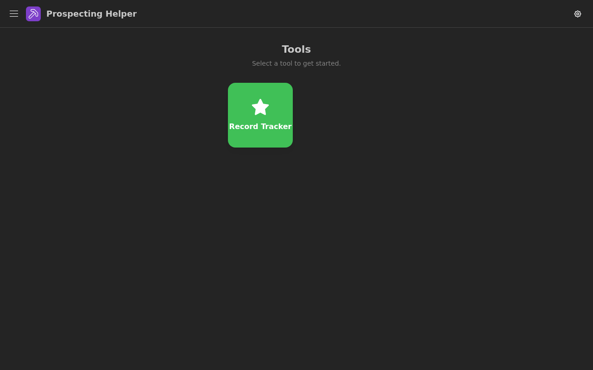
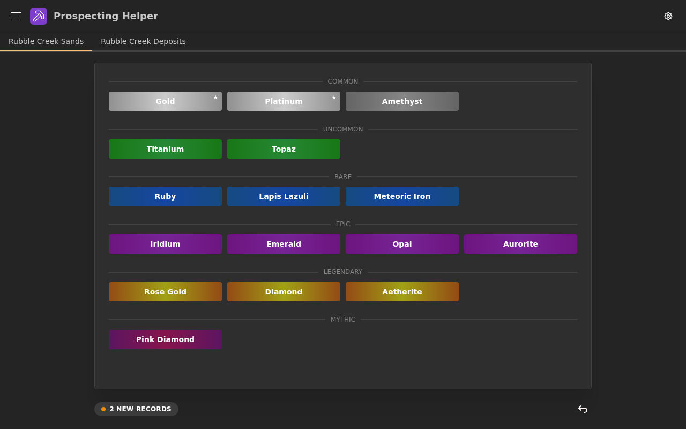

# Prospecting Helper

A session companion for the game **Prospecting!** — a collection of tools to help players during a prospecting run.

## Screenshots





## Tools

### Record Tracker

Track record-weight minerals across locations and deposits during a session.

- Browse mining locations and deposits from a collapsible sidebar
- Toggle minerals as records — tracked and highlighted per deposit
- Records bar shows all flagged minerals for the current deposit, sorted by rarity
- Supports The Void location with custom mineral entry
- Swipe left/right to navigate between deposits on mobile

## General Features

- Homepage with app card navigation
- Dark/light mode toggle
- Text scale toggle (1×, 1.5×, 2×) — mobile defaults to 1.5×
- Fully responsive — sidebar collapses to a hamburger menu on mobile

## Tech Stack

- [TypeScript](https://www.typescriptlang.org/)
- [React 19](https://react.dev/)
- [Vite](https://vitejs.dev/)
- [Mantine v9](https://mantine.dev/)
- [React Router v6](https://reactrouter.com/)
- [Tabler Icons](https://tabler.io/icons)

## Getting Started

```bash
npm install
npm run dev
```

## Deployment

Built as a static SPA and served via nginx in a Docker container.

```bash
docker compose up --build
```
